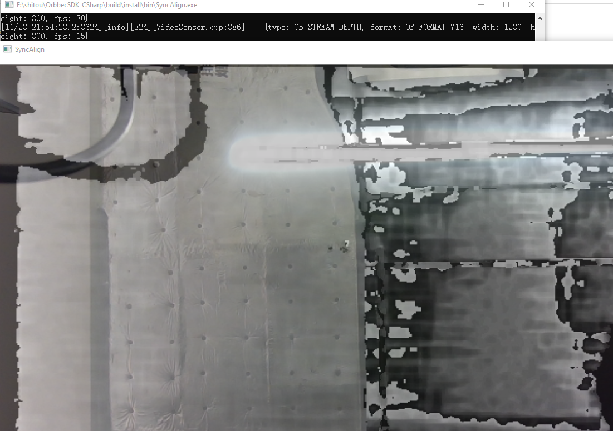

# Orbbec SDK C# Wrapper

This is a wrapper for the Orbbec SDK for C#. It provides a simple and easy-to-use interface for accessing the Orbbec camera and performing various operations such as capturing depth images, color images, and performing point cloud generation.

This branch is based on [Orbbec SDK v1](https://github.com/orbbec/OrbbecSDK) and 
The v2-main branch, C# Wrapper is based the open source version of [Orbbec SDK v2](https://github.com/orbbec/OrbbecSDK_v2). 

The C# wrapper for the open-source [Orbbec SDK v2](https://github.com/orbbec/OrbbecSDK_v2) is versioned as v2.x.x, while the C# wrapper for the [Orbbec SDK v1](https://github.com/orbbec/OrbbecSDK) is versioned as v1.x.x.

# Support Platforms
- Windows: Windows 10 (x64)

# Platform support
| **Products List** | **Firmware Version**        |
|-------------------|-----------------------------|
| Gemini 335        | 1.2.20                   |
| Gemini 335L        | 1.2.20                    |
| Gemini 336        | 1.2.20                      |
| Gemini 336L        | 1.2.20                    |

# Compile and run sample
Here, it is assumed that you have installed Cmake correctly. If you have not installed Cmake, you can refer to the Cmake official website for installation.
- Open Cmake, set the source code path, and set the “build” folder as the path for generating binary files, as shown in the following figure.

- First, click Configure, then select x64 in the dialog box that appears, and finally click Finish.

- Click “Generate”, as shown below:

- Use the file explorer to directly start the Visual Studio project in the build directory, as shown in the following figure:

- Open the project, as shown below, First, select Release, then choose ALL BUILD to compile, and finally select INSTALL.

- The compiled sample is located in the build/install/bin directory. 

- Click on 0.basic.quick_start.exe, and the running result is as follows:

                                                                               

